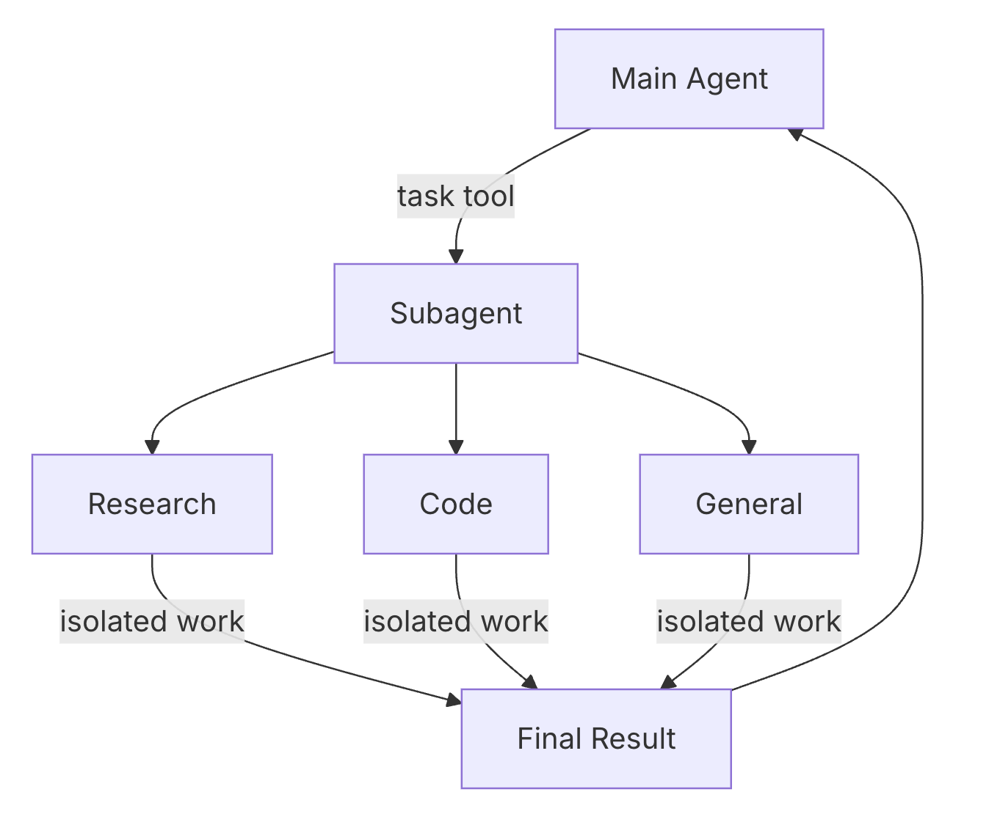

Add a custom tool alongside the built-ins, then a subagent that runs in its
own isolated context. The main agent calls it through `task()` and receives
only its final message.

[button label="Notebook" background="#7FC8FF" color="#030710"](tab-0)

---

<h2 style="color: #7FC8FF;">Step 1: Read the tool and the subagent</h2>

Run the setup cell, then the two cells that define them:

- **`tavily_search`** — a plain `@tool`-decorated function. Its body calls
  `resilient_tavily_search`, which retries and falls back to a canned response
  if Tavily fails.
- **`research_subagent`** — a dict, not a function: `name`, `description`,
  its own `system_prompt`, and the `tools` it gets.

> ⚠️ This challenge needs a working Tavily key. If the search returns the
> canned fallback response, the Check fails.

**Result:** `tool: tavily_search` and `subagent: research-agent`

---

<h2 style="color: #7FC8FF;">Step 2: Update your agent</h2>

Your `create_deep_agent()` call from Challenge 2 is below, with a research
`system_prompt` and two commented-out lines.

> **Uncomment both.** `tools=[tavily_search]` gives the agent direct web
> search. `subagents=[research_subagent]` gives it the `research-agent` to
> delegate to.

**Result:** a repr of your compiled deep agent.

---

<h2 style="color: #7FC8FF;">Step 3: Run it</h2>

Run the **"Run it"** cell. It asks a question recent enough that the model
has to look it up. `run_name` labels the run in LangSmith so the Check can
find it.

> **This cell can take a minute or more.** A delegated run is a full agent run
> of its own.

The first line of output is a **View the trace** link. In the trace, look for
`tavily_search` calls and any `task` call to `research-agent`.

**Result (example):** a research summary with citations.

---

<h2 style="color: #7FC8FF;">Step 4: Check</h2>

Click **Check**. It finds the `custom-tools-and-subagents` run in LangSmith
and confirms it contains a `tavily_search` call with real results. The agent
can call `tavily_search` directly or through `task()`. The trace shows which.

---

Next: Challenge 4 adds a store so memory persists across threads.
