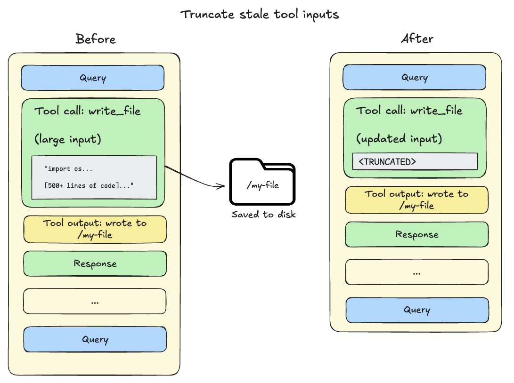
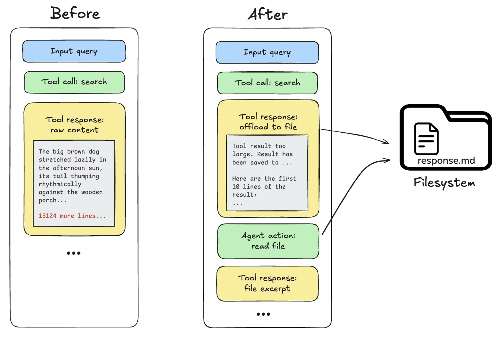
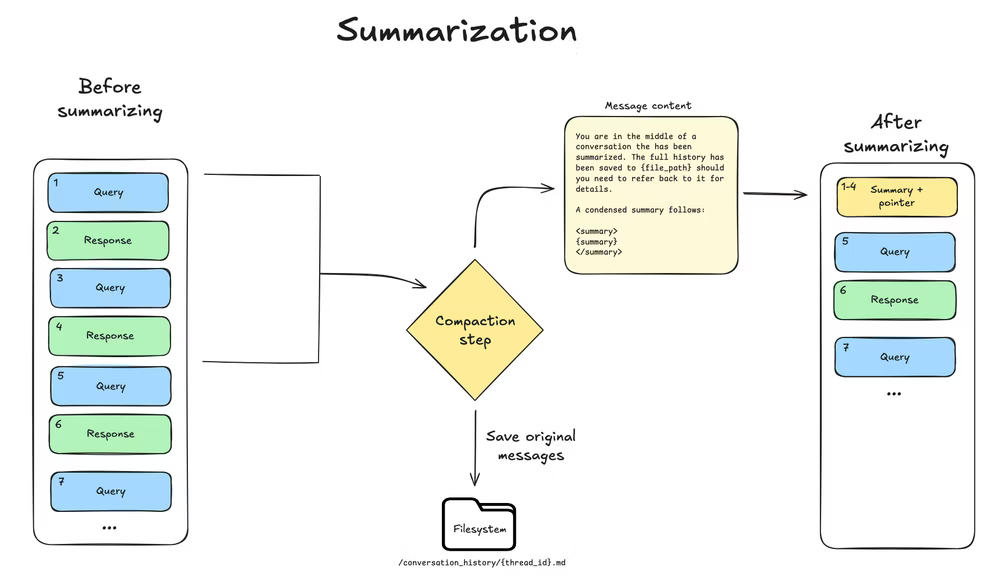
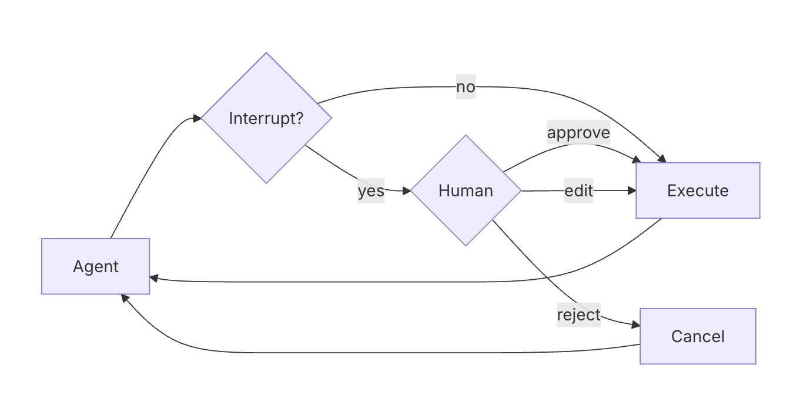

Middleware runs around every model and tool call without changes to agent
code. `interrupt_on` pauses a specific tool call for human-in-the-loop (HITL)
approval before it runs.

[button label="Notebook" background="#7FC8FF" color="#030710"](tab-0)

---

<h2 style="color: #7FC8FF;">Step 1: Read the middleware</h2>

Run the setup cell, then the cell that defines two middleware:

- **`compliance_rules`** — `wrap_model_call`, injects rules into every model call.
- **`audit_trail`** — `wrap_tool_call`, logs every tool call to `audit_log`.

Deep agents use the same mechanism internally to stay within the context
window:

**Result:** `middleware defined: compliance_rules, audit_trail`

---

<h2 style="color: #7FC8FF;">Step 2: Update your agent</h2>

Your `create_deep_agent()` call from Challenge 4 is below, with two new
commented-out blocks.

> **Uncomment both blocks.** `middleware=[compliance_rules, audit_trail],`
> adds the rules and auditing. `interrupt_on={...}` pauses before
> `write_file` or `edit_file` runs.

**Result:** a repr of your compiled deep agent.

---

<h2 style="color: #7FC8FF;">Step 3: Run it, then approve</h2>

Run the **"Run it"** cell. The agent pauses before `write_file`. Then run
**"Approve and continue"** to let it through.

Each cell prints a trace link first: the paused run, then the resumed run
with the approved `write_file`.

**Result:** `Approved!` followed by the agent's reply, then the audit log,
including a `write_file  success` entry.

---

<h2 style="color: #7FC8FF;">Step 4: Check</h2>

Click **Check**. It confirms in LangSmith that `write_file` to `/test.md` ran
after your approval, and that the compliance rules reached the model.

---

Next: Challenge 6 moves the system prompt into `AGENTS.md` and adds a skill.
