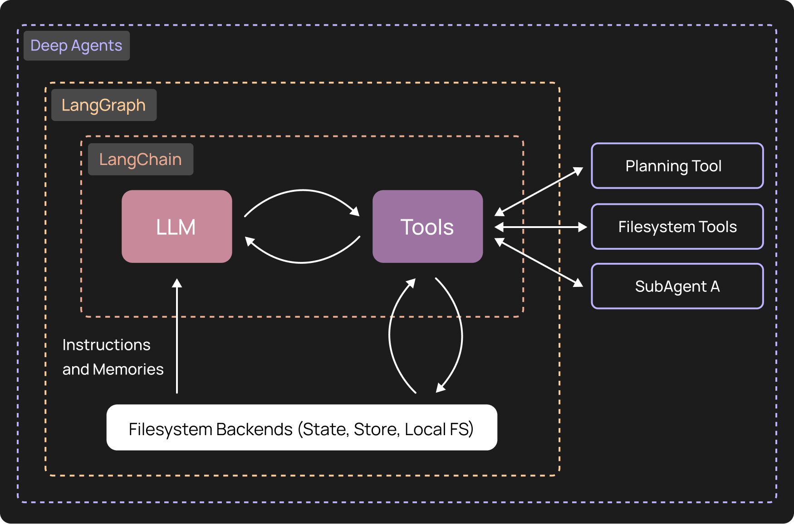

`create_agent()` runs a model with only the tools you give it.
`create_deep_agent()` adds a virtual filesystem, a to-do planner, and
subagents, which is what long, multi-step work needs.

[button label="Notebook" background="#7FC8FF" color="#030710"](tab-0)

---

<h2 style="color: #7FC8FF;">Step 1: Try the plain agent</h2>

Ask a plain `create_agent()` to write a file. It has no file tools, so it
can't.

**Result:** a text reply and `files in result: None`.

---

<h2 style="color: #7FC8FF;">Step 2: Build the deep agent</h2>

Paste the `create_deep_agent()` call from the notebook into the blank cell,
then give it the same task.

**Result:** `/haiku.txt` in the agent's files, and `write_file` in the trace.

---

<h2 style="color: #7FC8FF;">Step 3: Check</h2>

Click **Check**. It confirms your deep agent wrote `/haiku.txt`. Without a LangSmith key, it reads a local trace log instead.

---

Next: Challenge 3 adds a custom tool and a subagent.
