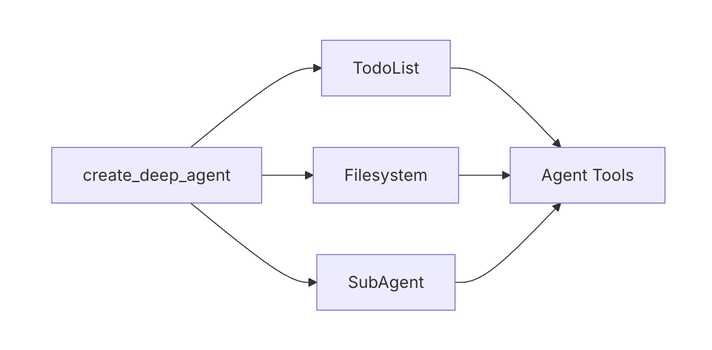

Middleware runs around every model and tool call, so rules and logging live
in one place instead of in every tool. Human-in-the-loop (HITL) pauses the
agent before risky actions so a person can approve them.

[button label="Notebook" background="#7FC8FF" color="#030710"](tab-0)

---

<h2 style="color: #7FC8FF;">Step 1: Add middleware and approval</h2>

Uncomment the `middleware=[...]` and `interrupt_on={...}` blocks.

**Result:** a repr of your compiled deep agent.

---

<h2 style="color: #7FC8FF;">Step 2: Run it, then approve</h2>

Run the agent. It pauses before `write_file`; approve it in the next cell.

**Result:** `Approved!`, the reply, and an audit log with `write_file  success`.

---

<h2 style="color: #7FC8FF;">Step 3: Check</h2>

Click **Check**. It confirms the write ran only after your approval. Without a LangSmith key, it reads a local trace log instead.

---

Next: Challenge 6 moves the instructions into a file and adds a skill.
