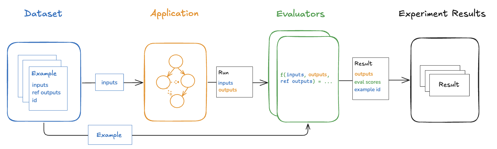
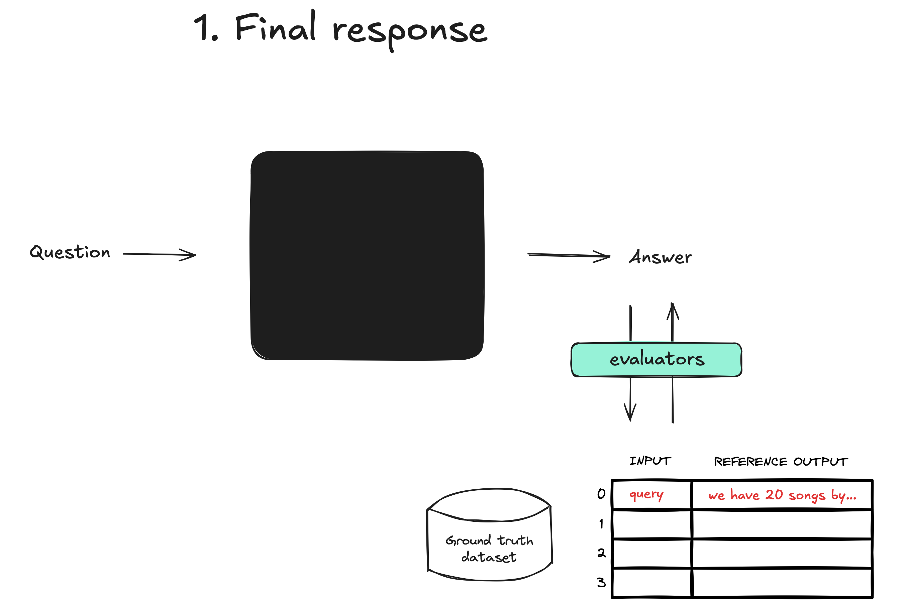
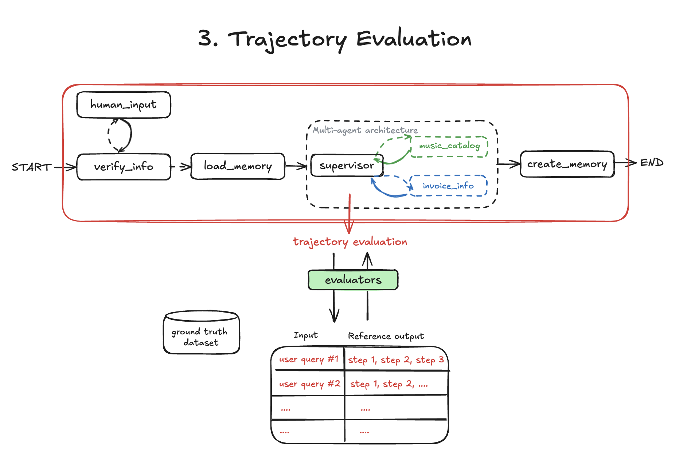

Score the agent over a fixed dataset, so prompt and model changes become
numbers you can compare. Scoring the tools it called catches right answers
reached the wrong way.

[button label="Notebook" background="#7FC8FF" color="#030710"](tab-0)

---

<h2 style="color: #7FC8FF;">Step 1: Judge the final answers</h2>

Build the dataset and run an experiment scored by an LLM judge. It takes a few
minutes.

**Result:** `Experiment: final-response-...`

---

<h2 style="color: #7FC8FF;">Step 2: Score the trajectory</h2>

Uncomment `evaluators=[...]` in the trajectory eval and run it.

**Result:** `Experiment: trajectory-...`. Compare both in **Datasets &
Experiments**.

---

<h2 style="color: #7FC8FF;">Step 3: Check</h2>

Click **Check**. It confirms your dataset has a scored trajectory experiment.

---

Next: Challenge 13 grades an agent by the files it leaves behind.
